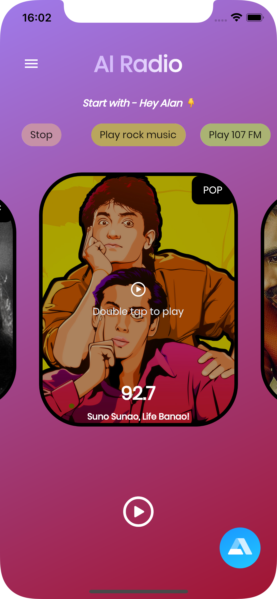

# VoiceWave
# VoiceWave

This is a radio app where you can ask Alan AI to play some music.

## Introduction
Have you ever wanted to tune into your favorite music simply by asking? Voice Wave Radio makes it possible. With this innovative radio app, you can enjoy a seamless listening experience by interacting with our AI assistant, Alan. No need to fumble with buttons or menus—just speak your commands and let Alan take care of the rest.

## Some screenshots

|                                      |                                      |
| ------------------------------------ | ------------------------------------ |
|  |  |
|   |   |
|   |

---

## Features
*AI-Powered Voice Assistant: Interact with Alan, our intelligent voice assistant, to play music effortlessly.

Music Playback: Simply ask Alan to play your favorite genre, artist, or song, and enjoy smooth music playback.

Customized Experience: Tailor your listening experience by requesting specific music preferences.

Hands-Free Operation: Keep your hands free while driving, cooking, or relaxing, and control your radio experience through voice commands.

User-Friendly Interface: Voice Wave Radio boasts an intuitive interface designed for seamless navigation and interaction.

## Example
User: Hey Alan, what does this app do?
Alan: This is a radio app where you can ask me to play some music. It's an AI-powered voice assistant radio app.
User: Play some classic music.
Alan: Playing now.
[Music starts playing]

## Let's Get Started!
Ready to experience the future of radio? Join us as we dive into creating this incredible AI-powered voice assistant radio app from scratch. Let's embark on this journey together and explore the endless possibilities of Voice Wave Radio.

Happy listening! 🎵📻
